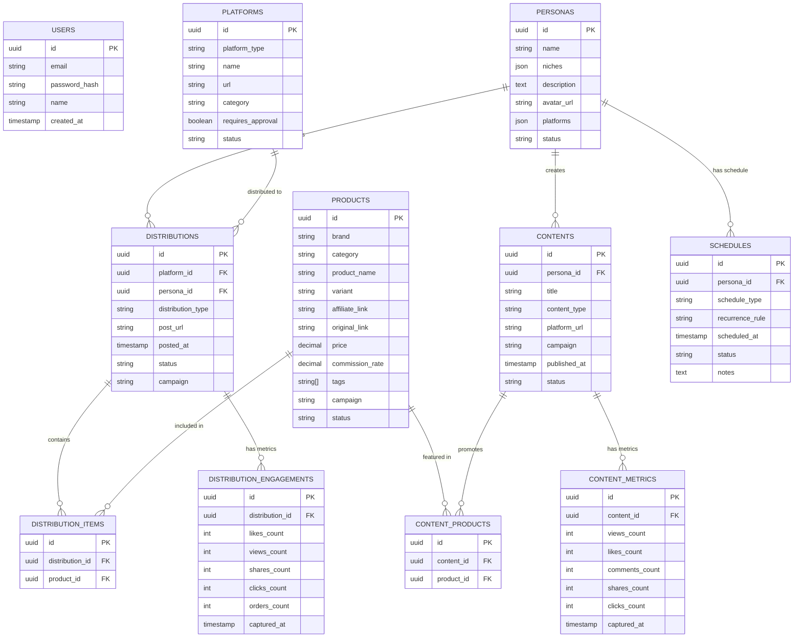

# 🔗 AFM Apps — Affiliate & Content Tracker

## Ringkasan Aplikasi

Web app untuk tracking **produk affiliate Shopee** yang disebar ke grup-grup Facebook, Instagram, dan platform lain — lengkap dengan tracking **konten video AI** dari persona (Bagas, Naya, dan bisa nambah), analisa waktu posting terbaik (research-based), dan reminder jadwal posting.

**Tech Stack**: Next.js 14+ · TypeScript · PostgreSQL (Supabase) · Prisma · shadcn/ui
**Deployment**: Vercel + Supabase
**User**: Single user dengan login/auth
**Future**: Mobile app untuk input, monitoring tetap di web app

---

## 🧩 Modul Aplikasi

| #   | Modul                     | Deskripsi                                                   |
| --- | ------------------------- | ----------------------------------------------------------- |
| 1   | **Products**              | Master data produk affiliate Shopee                         |
| 2   | **Platforms**             | Master data grup FB, akun IG, channel, dll                  |
| 3   | **Personas**              | Master data akun AI (Bagas, Naya, bisa nambah)              |
| 4   | **Distributions**         | Tracking sebar link ke grup/platform                        |
| 5   | **Content**               | Tracking konten video AI (Shopee Video, FB Reels, IG Reels) |
| 6   | **Dashboard & Analytics** | Summary, chart, best posting time (research-based)          |

Plus fitur pendukung: **Posting Schedule & Reminder**, **Duplicate Detection**, **Filter & Search**, **Campaign/Label**.

---

## 📊 Detail Per Modul

### Modul 1: Products (Master Data Produk)

| Field               | Type               | Keterangan                                        |
| ------------------- | ------------------ | ------------------------------------------------- |
| `id`                | UUID               | Auto-generated                                    |
| `brand`             | String             | Brand produk (Somethinc, Skintific, dll)          |
| `category`          | String             | Kategori (Skincare, Fashion, Elektronik)          |
| `product_name`      | String             | Nama produk                                       |
| `variant`           | String (nullable)  | Varian (ukuran, warna, dll)                       |
| `affiliate_link`    | String             | Short link dari Shopee Affiliate                  |
| `original_link`     | String (nullable)  | Link asli produk di Shopee                        |
| `price`             | Decimal            | Harga produk                                      |
| `commission_rate`   | Decimal            | Persentase komisi affiliate (%)                   |
| `commission_amount` | Decimal (computed) | Harga × Komisi (auto-hitung)                      |
| `tags`              | String[]           | Label/tag custom ("Promo 9.9", "High Commission") |
| `campaign`          | String (nullable)  | Nama campaign                                     |
| `notes`             | Text (nullable)    | Catatan bebas                                     |
| `status`            | Enum               | `active` / `expired` / `paused`                   |
| `created_at`        | Timestamp          |                                                   |
| `updated_at`        | Timestamp          |                                                   |

**Input**: Form manual. Bulk import via Excel template (Phase 4).

---

### Modul 2: Platforms (Master Data Grup & Channel)

| Field               | Type              | Keterangan                                                |
| ------------------- | ----------------- | --------------------------------------------------------- |
| `id`                | UUID              |                                                           |
| `platform_type`     | Enum              | `facebook` / `instagram` / `threads` / `tiktok` / `other` |
| `name`              | String            | Nama grup/channel ("Grup Skincare Indonesia")             |
| `url`               | String (nullable) | URL grup/channel                                          |
| `category`          | String            | Kategori grup (default: "Sebar link shopee affiliate")    |
| `requires_approval` | Boolean           | Butuh approval posting/comment?                           |
| `notes`             | Text (nullable)   | Catatan bebas                                             |
| `status`            | Enum              | `active` / `inactive`                                     |
| `created_at`        | Timestamp         |                                                           |
| `updated_at`        | Timestamp         |                                                           |

---

### Modul 3: Personas (Akun AI)

| Field         | Type              | Keterangan                                   |
| ------------- | ----------------- | -------------------------------------------- |
| `id`          | UUID              |                                              |
| `name`        | String            | Nama persona ("Bagas" / "Naya")              |
| `niches`      | JSON (String[])   | Array of niches — 1 persona bisa multi-niche |
| `description` | Text              | Deskripsi persona                            |
| `avatar_url`  | String (nullable) | Foto profil persona                          |
| `platforms`   | JSON              | Akun per platform (FB, IG, dll)              |
| `status`      | Enum              | `active` / `inactive`                        |
| `created_at`  | Timestamp         |                                              |
| `updated_at`  | Timestamp         |                                              |

**Contoh data `niches`**:

```json
// Bagas
["gym", "outfit", "parfum", "lifestyle cowok"]

// Naya
["skincare", "homeliving", "beauty"]
```

Persona bisa ditambah kapan aja (bukan cuma Bagas & Naya). Sistem di-design extensible dari awal.

---

### Modul 4: Distributions (Sebar Link)

| Field               | Type              | Keterangan                                                          |
| ------------------- | ----------------- | ------------------------------------------------------------------- |
| `id`                | UUID              |                                                                     |
| `platform_id`       | FK → Platforms    | Grup/channel mana                                                   |
| `persona_id`        | FK → Personas     | Posting pakai akun siapa                                            |
| `distribution_type` | Enum              | `post` / `comment`                                                  |
| `post_url`          | String            | Link postingan/comment di platform                                  |
| `posted_at`         | Timestamp         | Tanggal & jam sebar                                                 |
| `status`            | Enum              | `posted` / `pending_approval` / `approved` / `deleted` / `rejected` |
| `campaign`          | String (nullable) | Nama campaign                                                       |
| `notes`             | Text (nullable)   | Catatan                                                             |
| `created_at`        | Timestamp         |                                                                     |
| `updated_at`        | Timestamp         |                                                                     |

#### Distribution Items (Sub-tabel)

1 post/comment bisa contain multiple produk (misal 5 link produk di 1 comment).

| Field             | Type               | Keterangan          |
| ----------------- | ------------------ | ------------------- |
| `id`              | UUID               |                     |
| `distribution_id` | FK → Distributions | Parent distribution |
| `product_id`      | FK → Products      | Produk mana         |

**Batch Distribution Flow**:

1. Pilih produk (bisa multi-select)
2. Pilih grup target (bisa multi-select, misal 10 grup)
3. Pilih persona (Bagas/Naya/lainnya)
4. Pilih tipe (post/comment)
5. Submit → otomatis bikin 10 distribution records
6. Link postingan bisa diisi nanti

#### Distribution Engagements

| Field             | Type               | Keterangan                                    |
| ----------------- | ------------------ | --------------------------------------------- |
| `id`              | UUID               |                                               |
| `distribution_id` | FK → Distributions |                                               |
| `likes_count`     | Integer            | Jumlah like/reaction                          |
| `views_count`     | Integer            | Jumlah views                                  |
| `shares_count`    | Integer            | Jumlah share                                  |
| `clicks_count`    | Integer            | Click count (dari Shopee Affiliate dashboard) |
| `orders_count`    | Integer (nullable) | Jumlah order/conversion                       |
| `captured_at`     | Timestamp          | Kapan data ini di-capture                     |
| `created_at`      | Timestamp          |                                               |

Engagement bisa di-input berkali-kali untuk distribution yang sama (capture hari ke-1, hari ke-3, hari ke-7) supaya bisa lihat trend over time.

---

### Modul 5: Content (Konten Video AI)

Tracking konten video AI yang di-post di Shopee Video, FB Reels, IG Reels. Hanya track metadata + metrics, bukan host video.

| Field          | Type              | Keterangan                                                    |
| -------------- | ----------------- | ------------------------------------------------------------- |
| `id`           | UUID              |                                                               |
| `persona_id`   | FK → Personas     | Video dari persona siapa                                      |
| `title`        | String            | Judul/deskripsi singkat video                                 |
| `content_type` | Enum              | `shopee_video` / `fb_reels` / `ig_reels` / `tiktok` / `other` |
| `platform_url` | String            | Link ke video di platform                                     |
| `campaign`     | String (nullable) | Nama campaign                                                 |
| `published_at` | Timestamp         | Kapan video di-publish                                        |
| `notes`        | Text (nullable)   |                                                               |
| `status`       | Enum              | `published` / `draft` / `deleted`                             |
| `created_at`   | Timestamp         |                                                               |
| `updated_at`   | Timestamp         |                                                               |

#### Content Products (Relasi Many-to-Many)

| Field        | Type          | Keterangan                      |
| ------------ | ------------- | ------------------------------- |
| `id`         | UUID          |                                 |
| `content_id` | FK → Contents |                                 |
| `product_id` | FK → Products | Produk yang di-promote di video |

#### Content Metrics

| Field            | Type               | Keterangan            |
| ---------------- | ------------------ | --------------------- |
| `id`             | UUID               |                       |
| `content_id`     | FK → Contents      |                       |
| `views_count`    | Integer            | Jumlah views          |
| `likes_count`    | Integer            |                       |
| `comments_count` | Integer            |                       |
| `shares_count`   | Integer            |                       |
| `saves_count`    | Integer (nullable) |                       |
| `clicks_count`   | Integer (nullable) | Click ke produk       |
| `captured_at`    | Timestamp          | Kapan data di-capture |
| `created_at`     | Timestamp          |                       |

---

### Modul 6: Dashboard & Analytics

#### 6a. Dashboard Summary (Home Page)

| Widget                         | Deskripsi                            |
| ------------------------------ | ------------------------------------ |
| **Total Produk Aktif**         | Card counter                         |
| **Total Distribusi Bulan Ini** | Card counter                         |
| **Total Konten Video**         | Card counter                         |
| **Estimasi Earning Bulan Ini** | Dari komisi × conversion             |
| **Top 5 Produk**               | By clicks / orders                   |
| **Top 5 Grup**                 | By engagement                        |
| **Top Persona**                | Performance comparison antar persona |
| **Distribusi per Platform**    | Pie chart (FB / IG / Threads)        |
| **Trend Distribusi**           | Line chart per minggu/bulan          |
| **Recent Activity**            | Timeline sebar link terbaru          |

#### 6b. Best Posting Time — HALAMAN TERPISAH (Research-Based)

Data waktu posting terbaik BUKAN dari data historis user, tapi dari hasil research.

| Fitur                      | Deskripsi                                                          |
| -------------------------- | ------------------------------------------------------------------ |
| **Best Time per Platform** | Rekomendasi jam terbaik untuk Facebook, Instagram, Threads, TikTok |
| **Best Time per Niche**    | Waktu terbaik per kategori/niche (Skincare, Fashion, Gym, dll)     |
| **Best Day of Week**       | Hari terbaik untuk posting per platform                            |
| **Heatmap Visual**         | Heatmap hari × jam yang nunjukin "zona emas" posting               |
| **Tips & Notes**           | Tips posting berdasarkan riset                                     |
| **Persona Recommendation** | Rekomendasi khusus per persona berdasarkan niche mereka            |

**Data Riset Waktu Posting Terbaik:**

##### Facebook Groups

| Hari    | Jam Terbaik   | Engagement Level           |
| ------- | ------------- | -------------------------- |
| Selasa  | 09:00 - 12:00 | 🟢 Tinggi                  |
| Rabu    | 09:00 - 12:00 | 🟢 Tinggi                  |
| Kamis   | 12:00 - 15:00 | 🟡 Sedang-Tinggi           |
| Jumat   | 09:00 - 11:00 | 🟡 Sedang                  |
| Weekend | 10:00 - 14:00 | 🟢 Tinggi (grup lifestyle) |

##### Instagram Reels

| Hari           | Jam Terbaik                  | Notes                       |
| -------------- | ---------------------------- | --------------------------- |
| Senin          | 06:00 - 08:00, 18:00 - 21:00 | Pagi commute + malam scroll |
| Selasa - Kamis | 11:00 - 13:00, 19:00 - 21:00 | Lunch break + prime time    |
| Jumat          | 11:00 - 13:00                | Before weekend              |
| Sabtu          | 09:00 - 11:00                | Weekend browsing            |
| Minggu         | 10:00 - 14:00                | Leisure time                |

##### Per Niche (Indonesia Market)

| Niche           | Peak Time                    | Best Day      | Notes                         |
| --------------- | ---------------------------- | ------------- | ----------------------------- |
| Skincare/Beauty | 19:00 - 22:00                | Sel, Rab, Kam | Setelah kerja, self-care time |
| Fashion/Outfit  | 11:00 - 14:00, 19:00 - 21:00 | Rab, Kam, Sab | Lunch OOTD + evening planning |
| Gym/Fitness     | 05:00 - 07:00, 17:00 - 19:00 | Sen, Sel, Kam | Pre/post workout              |
| Parfum          | 18:00 - 21:00                | Kam, Jum, Sab | Evening vibes, pre-weekend    |
| Home Living     | 09:00 - 12:00, 20:00 - 22:00 | Sab, Min      | Weekend home improvement      |

Data riset ini di-hardcode di app sebagai referensi. Bisa di-update manual kalau ada data baru.

#### 6c. Posting Schedule & Reminder

| Fitur                         | Deskripsi                                                      |
| ----------------------------- | -------------------------------------------------------------- |
| **Calendar View**             | Kalender jadwal posting (planned) dan history (done)           |
| **Create Schedule**           | Bikin jadwal: produk apa, grup mana, jam berapa, persona siapa |
| **Browser Push Notification** | Reminder sebelum jadwal posting                                |
| **Recurring Schedule**        | Jadwal berulang (misal: setiap Selasa & Kamis jam 19:00)       |
| **Suggested Time**            | Auto-suggest waktu berdasarkan data riset per niche/platform   |
| **Status Tracking**           | Scheduled → Reminded → Posted / Missed                         |

---

## 🔔 Fitur Pendukung

### Duplicate Detection

- Saat input distribusi baru, auto-check apakah produk sama udah pernah disebar di grup yang sama
- Warning: "⚠️ Produk ini udah pernah disebar di Grup X pada tanggal Y"
- User bisa tetap proceed (warning, bukan blocker)

### Filter & Search (Global)

- Search: Cari produk by nama/brand, grup by nama
- Filter by: Brand, Kategori, Platform, Persona, Campaign, Date Range, Status, Tags
- Tersedia di semua halaman list

### Campaign / Label System

- Tag/label bisa di-attach ke Products, Distributions, dan Content
- Campaign grouping: "Promo 9.9", "Campaign Ramadan", "Flash Sale Mei"
- Filter dan reporting per campaign

---

## 🏗️ Arsitektur & Tech Stack

```
┌──────────────────────────────────────────────────────────┐
│                    Frontend (Next.js 14+)                 │
│                                                          │
│  Auth │ Dashboard │ Products │ Platforms │ Personas       │
│  Distributions │ Content │ Analytics │ Schedule           │
│                                                          │
│  UI: shadcn/ui + Tailwind CSS                            │
│  Charts: Recharts                                        │
│  Calendar: React Big Calendar / custom                   │
│  State: TanStack Query                                   │
│  Detail Views: Modal / Sheet (bukan halaman terpisah)    │
└────────────────────────┬─────────────────────────────────┘
                         │
                         ▼
┌──────────────────────────────────────────────────────────┐
│                Backend (Next.js API Routes)               │
│                                                          │
│  Auth (NextAuth.js) │ CRUD APIs │ Analytics Engine        │
│  Reminder Service (Web Push) │ Duplicate Checker          │
│  Batch Processor │ Schedule Cron                          │
│                                                          │
│  ORM: Prisma                                             │
└────────────────────────┬─────────────────────────────────┘
                         │
                         ▼
┌──────────────────────────────────────────────────────────┐
│              PostgreSQL (Supabase)                        │
│                                                          │
│  users │ products │ platforms │ personas                  │
│  distributions │ distribution_items                       │
│  distribution_engagements │ contents │ content_products   │
│  content_metrics │ schedules                              │
└──────────────────────────────────────────────────────────┘
db : qn1BU4fovfqvLUkL

Deployment: Vercel (frontend + API) + Supabase (database)
```

### Tech Stack Detail

| Layer             | Teknologi                   | Alasan                                    |
| ----------------- | --------------------------- | ----------------------------------------- |
| **Framework**     | Next.js 14+ (App Router)    | Full-stack, SSR, API routes built-in      |
| **Language**      | TypeScript                  | Type safety, better DX                    |
| **UI Library**    | shadcn/ui + Tailwind CSS    | Modern, customizable, production-ready    |
| **Charts**        | Recharts                    | React-native charts, bagus buat dashboard |
| **Database**      | PostgreSQL (Supabase)       | Reliable, free tier, managed              |
| **ORM**           | Prisma                      | Type-safe queries, migration management   |
| **Auth**          | NextAuth.js (Auth.js)       | Simple auth, credentials login            |
| **State**         | TanStack Query              | Server state management, caching          |
| **Calendar**      | React Big Calendar / custom | Posting schedule view                     |
| **Notifications** | Web Push API                | Browser push notification untuk reminder  |
| **Deployment**    | Vercel + Supabase           | Free tier, easy deploy                    |

---

## 📐 Entity Relationship Diagram



---

## 📱 Halaman Aplikasi

Detail view (produk detail, distribusi detail, konten detail) pakai Modal/Sheet, bukan halaman terpisah.

| #   | Halaman               | Deskripsi                                                                        |
| --- | --------------------- | -------------------------------------------------------------------------------- |
| 1   | **Login**             | Email + password                                                                 |
| 2   | **Dashboard**         | Summary cards, charts, recent activity                                           |
| 3   | **Products**          | List + CRUD produk, filter, search. Detail via modal                             |
| 4   | **Platforms**         | List + CRUD grup/channel. Detail via modal                                       |
| 5   | **Personas**          | List + CRUD persona, performance comparison. Detail via modal                    |
| 6   | **Distributions**     | List distribusi, filter, search. Detail + engagement input via modal             |
| 7   | **Distribution Form** | Input distribusi — single mode & batch mode (multi-produk × multi-grup)          |
| 8   | **Content**           | List konten video. Detail + metrics input via modal                              |
| 9   | **Content Form**      | Input konten video baru                                                          |
| 10  | **Best Posting Time** | Referensi waktu posting terbaik (research-based), heatmap, rekomendasi per niche |
| 11  | **Schedule**          | Calendar view, create/manage jadwal posting + reminder                           |

---

## 📁 Project Structure

```
afm_apps/
├── prisma/
│   └── schema.prisma
├── public/
│   └── ...
├── src/
│   ├── app/
│   │   ├── (auth)/
│   │   │   └── login/page.tsx
│   │   ├── (dashboard)/
│   │   │   ├── page.tsx                # Dashboard
│   │   │   ├── products/page.tsx
│   │   │   ├── platforms/page.tsx
│   │   │   ├── personas/page.tsx
│   │   │   ├── distributions/
│   │   │   │   ├── page.tsx
│   │   │   │   └── new/page.tsx        # Single + Batch form
│   │   │   ├── content/
│   │   │   │   ├── page.tsx
│   │   │   │   └── new/page.tsx
│   │   │   ├── best-time/page.tsx
│   │   │   ├── schedule/page.tsx
│   │   │   └── layout.tsx              # Dashboard layout (sidebar)
│   │   ├── api/
│   │   │   ├── auth/[...nextauth]/route.ts
│   │   │   ├── products/route.ts
│   │   │   ├── platforms/route.ts
│   │   │   ├── personas/route.ts
│   │   │   ├── distributions/route.ts
│   │   │   ├── content/route.ts
│   │   │   ├── engagements/route.ts
│   │   │   ├── schedules/route.ts
│   │   │   └── analytics/route.ts
│   │   └── layout.tsx
│   ├── components/
│   │   ├── ui/                         # shadcn/ui components
│   │   ├── modals/                     # Detail modals
│   │   │   ├── ProductDetailModal.tsx
│   │   │   ├── PlatformDetailModal.tsx
│   │   │   ├── DistributionDetailModal.tsx
│   │   │   └── ContentDetailModal.tsx
│   │   ├── forms/                      # Input forms
│   │   ├── charts/                     # Dashboard charts
│   │   └── shared/                     # Shared components
│   ├── lib/
│   │   ├── prisma.ts
│   │   ├── auth.ts
│   │   ├── utils.ts
│   │   └── constants/
│   │       └── best-posting-times.ts   # Research data (hardcoded)
│   ├── hooks/
│   └── types/
├── .env
├── package.json
├── tailwind.config.ts
├── tsconfig.json
└── next.config.ts
```

---

## 🚀 Phasing / Prioritas Build

### Phase 1 — Core (MVP)

> Fokus: bisa input dan lihat data dasar

- [x] Project setup (Next.js + Prisma + Supabase + shadcn/ui)
- [x] Auth (login/register)
- [x] CRUD Products (form + list + modal detail)
- [x] CRUD Platforms (form + list + modal detail)
- [ ] CRUD Personas (form + list + modal detail)
- [ ] CRUD Distributions — single input
- [ ] Batch Distribution input (multi-produk × multi-grup)
- [ ] Dashboard Summary (basic cards + charts)
- [ ] Filter & Search (basic)

### Phase 2 — Content & Engagement

> Fokus: tracking konten video + engagement

- [ ] CRUD Content (video tracking)
- [ ] Content Metrics input (via modal)
- [ ] Distribution Engagement input (via modal)
- [ ] Duplicate Detection
- [ ] Campaign / Tag management
- [ ] Dashboard enhanced (top produk, top grup, persona comparison)

### Phase 3 — Analytics & Schedule

> Fokus: analisa dan planning

- [ ] Best Posting Time page (research-based data + heatmap)
- [ ] Posting Schedule (calendar view)
- [ ] Browser Push Notification reminder
- [ ] Recurring schedule
- [ ] Per-campaign reporting

### Phase 4 — Enhancement (Nice-to-have)

> Fokus: convenience

- [ ] Bulk import via Excel template + download template
- [ ] Export data ke CSV/Excel
- [ ] Mobile app (input only)
- [ ] Engagement trend charts (over time)

---

## ✅ Verification Plan

### Automated

- Unit test untuk API routes (CRUD, batch distribution, analytics)
- Integration test untuk database queries
- E2E test: login → input produk → batch distribusi → lihat dashboard

### Manual

- Review UI/UX di browser
- Test batch distribution flow (multi-produk ke multi-grup)
- Test reminder notification di browser
- Validate dashboard charts dengan data sample
- Test modal detail views di semua modul
